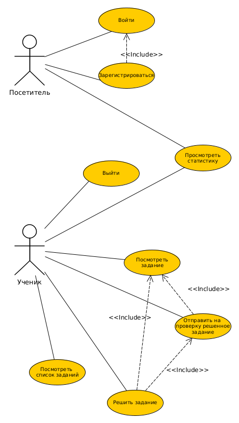
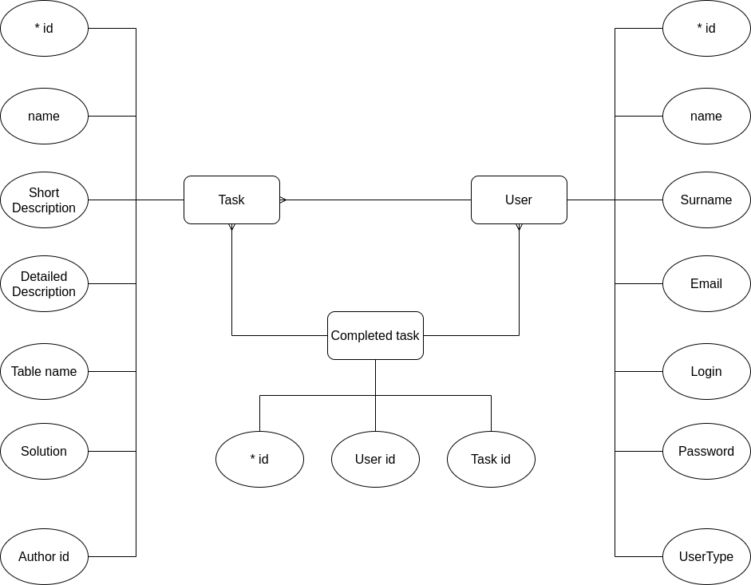

# BMSTU6_PPO

<!-- 

  -->

### Цель работы

<!-- Создать WEB-сайт для возможности улучшения навыков  построения запросов к базе данных.  -->
Целью работы является разработка WEB-сайта, который предоставляет платформу для решения sql-запросов.

### Решаемая проблема

Данный сайт решает проблему недостаточного количества практики. 
Он предоставляет возможность решать задачи днем и ночью и улучшать свои скилы в области написания sql-запросов. 

### Функционал 

* Регистрация
* Выход из системы
* Просмотр статистики
* Просмотр всех существующих задач
* Просмотр конкретной задачи
* Решение конкретной задачи

### Use-case диаграмма

### Er-диаграмма сущностей системы

### swagger

[Click me](https://app.swaggerhub.com/apis/Sunshine-ki/WEB/1.0.0)
